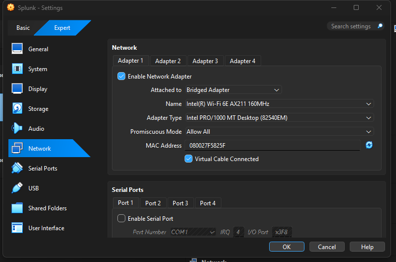
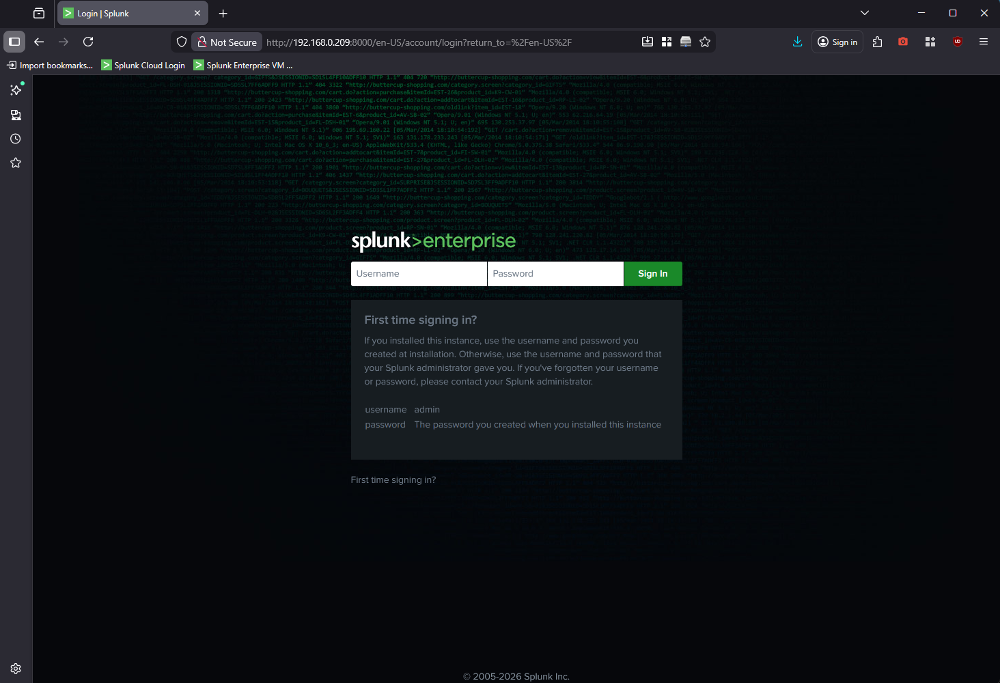
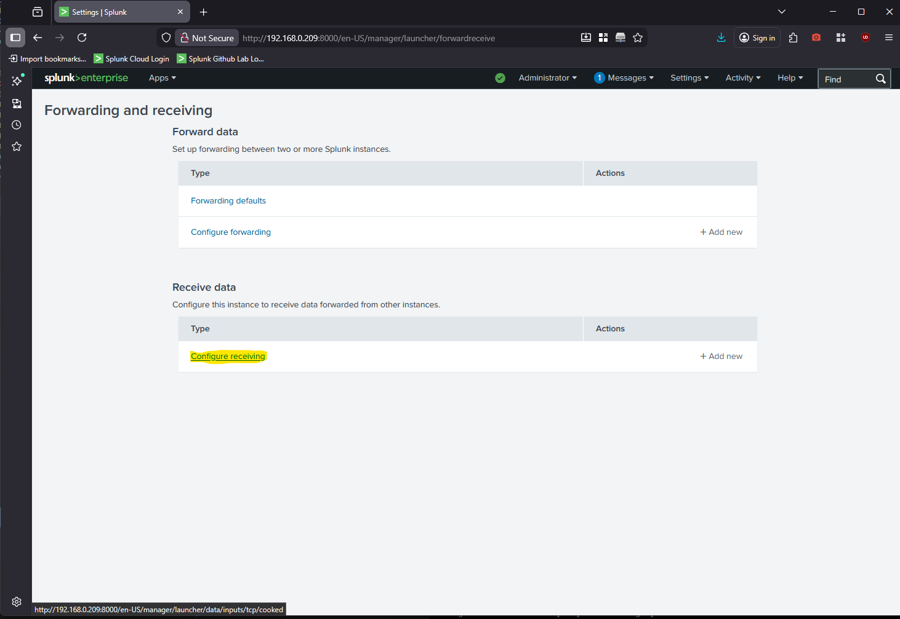
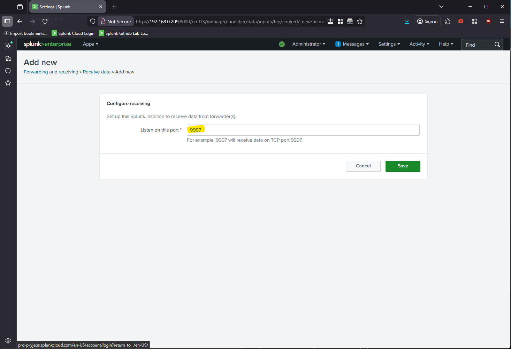
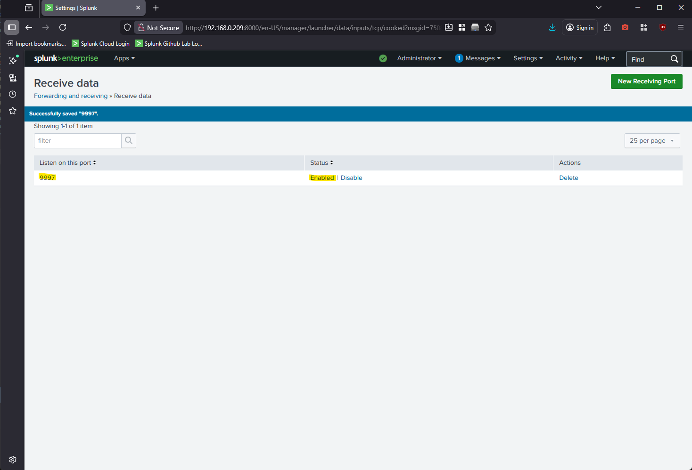

# Splunk SIEM Homelab Breakdown

⚙️ The exercises and work in this lab environment were conducted utilizing Splunk Enterprise.

## Table of Contents

* [Introduction](#introduction)
* [Lab Environment](#lab-environment)
* [Network Configuration](#network-configuration)
* [Initial Environment Setup](#initial-environment-setup)
  * [Windows Machines](#windows-machines)
  * [Linux Machines](#linux-machines) 
* [Installation of Splunk Enterprise on Linux](#installation-of-splunk-enterprise-on-linux)
* [Forwarding Data into Splunk on Linux](#forwarding-data-into-splunk-on-linux)
* [Forwarding Data into Splunk on Windows](#forwarding-data-into-splunk-on-windows)

## Introduction
This document provides a comprehensive technical overview of the Splunk Core User lab exercises. It is intended to summarize the key activities, configurations, and workflows completed during the lab, providing a reference for understanding core Splunk functionalities, data ingestion processes, search operations, and reporting techniques.

The content is structured to give both a high-level perspective of the lab objectives and a detailed breakdown of the technical steps taken, including examples of searches, dashboards, and knowledge objects created. This overview serves as a practical guide for reinforcing Splunk core concepts and as a resource for future labs or real-world applications.

## Lab Environment

The lab environment was designed to simulate a small, multi-host infrastructure suitable for testing Splunk Enterprise data ingestion, forwarding, and analysis workflows. All systems were deployed as virtual machines running on Oracle VirtualBox, enabling isolated testing and controlled network communication between hosts.

#### 🖥️ Host System

The host system used to run the virtual machines is a desktop computer running **Windows 11 Pro**.

#### 📊 Splunk Platform

**Splunk Enterprise** was used as the primary platform for log ingestion, search, and visualization. The environment included both Windows and Linux systems to reflect common enterprise operating system diversity and support varied data sources.

#### 🧩 Virtual Machines

The following virtual machines were deployed as part of the lab environment:

* **Windows 11 Workstation** – IP Address: `192.168.32.`
  * Operating System: Windows 11 Pro 🪟
  * Role: Workstation log source for Windows-based event and system data
* **Windows 10 Workstation** - IP Address: `192.168.167.`
  * Operating System: Windows 10 Home 🪟
  * Role: Additional Windows workstation log source for comparative analysis and ingestion testing
* **Splunk** – IP Address: `192.168.209.`
  * Operating System: Ubuntu Server 🐧
  * Role: Primary Splunk Enterprise instance responsible for data indexing, searching, and visualization
* **SplunkFWD** – IP Address: `192.168.178.` 
  * Operating System: Ubuntu Server 🐧
  * Role: Dedicated forwarder system used to collect and send log data to the Splunk Enterprise instance

## Network Configuration

All virtual machines' network adapters were changed from "NAT" to "Bridged Adapter", and Promiscuous Mode was set to "Allow All" in their VirtualBox configuration settings.



This configuration enabled testing of centralized log collection, cross-platform data ingestion, and basic forwarder-to-indexer communication within a virtualized lab environment. The setup provides a scalable foundation for expanding into more advanced Splunk use cases, including dashboards, alerts, and security-focused analysis.  

## Initial Environment Setup

#### Windows Machines

The PuTTY application was installed on the host machine to enable remote connections to Virtual Machines outside of the VirtualBox console. This approach simulates how systems or servers are commonly accessed remotely in enterprise environments to perform updates or configuration changes. For the purposes of this lab, SSH-based remote access was used to allow efficient interaction with the Ubuntu servers, including the ability to easily copy and paste longer commands.

The Windows virtual machines (Windows 10 Workstation and Windows 11 Workstation) were deployed using standard Windows installation procedures. No custom configurations or additional software were applied during the initial setup phase beyond default system settings.

After installation, both systems were fully updated using Windows Update to ensure the latest security patches and system updates were applied. These machines were prepared to function as log-generating endpoints for Splunk data ingestion and analysis in later stages of the lab.

At this stage of the environment setup, the Windows systems were intentionally kept in a baseline configuration to reflect a typical enterprise workstation prior to log forwarding or agent installation.

#### Linux Machines

On the Linux virtual machines, once the operating system installation was completed, each system was logged into and fully updated to ensure it was running the latest available packages. This was accomplished using the following commands:

```bash
sudo apt update
sudo apt full-upgrade -y
```

After completing system updates, the OpenSSH server was installed to enable remote terminal access using the following command:

```bash
sudo apt install openssh-server
```

Installing OpenSSH allows remote connections to the Ubuntu servers from another Linux system via the terminal or from a Windows system using tools such as PuTTY.

To verify the status of the SSH service, the following command was executed:

```bash
systemctl status ssh
```

Initially, the SSH service was not running. The service was started using:

```bash
sudo systemctl start ssh
```

To ensure the SSH service starts automatically upon system boot, it was enabled using:

```bash
sudo systemctl enable ssh
```

This configuration ensured persistent remote access to the Linux-based Splunk systems throughout the duration of the lab.

## Installation of Splunk Enterprise on Linux

### Initial Install

The Splunk Enterprise free trial was used for this lab environment. After navigating to the Downloads section of the official Splunk website, the Linux installation package for Splunk Enterprise in `.tgz` format was selected for deployment. 

The following `wget` command was then executed on the **Splunk** Ubuntu virtual machine to download the installation package directly to the system:

```bash
sudo wget -O splunk-10.2.0-d749cb17ea65-linux-amd64.tgz "https://download.splunk.com/products/splunk/releases/10.2.0/linux/splunk-10.2.0-d749cb17ea65-linux-amd64.tgz"
```

The command was run over a remote SSH session established using PuTTY from the host machine. Using SSH access allowed for efficient interaction with the Linux environment, including the ability to easily copy and paste longer commands. 

Once the download completed, the compressed archive was extracted into the `/opt` directory, which is the standard installation path for Splunk on Linux systems:

```bash
sudo tar xvzf splunk-10.2.0-d749cb17ea65-linux-amd64.tgz -C /opt
```

### Starting Splunk Instance

After extraction, the Splunk binaries were available under `/opt/splunk`. The following commands were then used to navigate to the Splunk `bin` directory in preparation for starting the service:

```bash
cd /opt/splunk/bin
sudo ./splunk start --accept-license
```

The `--accept-license` flag automatically accepts the Splunk software license agreement, allowing the service to start without requiring manual confirmation. During the initial startup process, the user is prompted to create an administrative username and password. 

Once initialization completes, Splunk provides a URL for accessing the Splunk web interface. For this lab, the interface is accessed using **http://192.168.0.209:8000**, as DNS was not configured within the lab network.



To ensure the Splunk service starts automatically when the Ubuntu server boots, the following command was executed:

```bash
sudo ./splunk enable boot-start
```

**Note**: When running this command, the user must be located in the `/opt/splunk/bin` directory.

### Configure Receiving Within Splunk

This Splunk instance serves as the search head within the lab infrastructure. In order to receive data forwarded from other systems, receiving must be enabled through the Splunk web interface.

After logging into Splunk, navigate to the following location: 

`Settings > Forwarding and Receiving > Configure Receiving`



From this page, **New Receiving Port** is selected and the port is configured as **9997**, which is the default port used by Splunk for receiving forwarded data. After entering the port number, the configuration is saved.



Once this step is complete, the search head is actively listening on port 9997 and is ready to receive incoming data from Splunk forwarders deployed throughout the lab environment.



## Forwarding Data into Splunk on Linux

The next step in the lab is to configure the SplunkFWD virtual machine as a Splunk Universal Forwarder. Before configuring a Universal Forwarder, it is critical to ensure that receiving is enabled on the Search Head/Indexer, which was completed in the previous section.

In this phase, the Splunk Universal Forwarder for Linux is installed on the SplunkFWD system, a least-privileged user is created to run the forwarder, and the system is configured to forward log data to the Search Head/Indexer.

### Download and Extract the Universal Forwarder

The Splunk Universal Forwarder Downloads section on the official Splunk website was accessed, and the Linux x64 installation package in `.tgz` format was selected. The following `wget` command was executed on the SplunkFWD system to initiate the download:

```bash
wget -O splunkforwarder-10.2.0-d749cb17ea65-linux-amd64.tgz "https://download.splunk.com/products/universalforwarder/releases/10.2.0/linux/splunkforwarder-10.2.0-d749cb17ea65-linux-amd64.tgz"
```

The command was run over a remote SSH session established using PuTTY from the host machine.

Once the download completed, the compressed archive was extracted into the `/opt` directory, which is the standard installation location for Splunk components on Linux systems:

```
sudo tar xvzf splunkforwarder-10.2.0-d749cb17ea65-linux-amd64.tgz -C /opt 
```

After extraction, the /opt directory was checked to confirm the presence of the splunkforwarder directory, and the working directory was changed accordingly:

```
cd /opt
ls
cd /splunkforwarder
```

### Create Forwarder User and Set Permissions

The Splunk Universal Forwarder is designed to run under a least-privileged user account. For this reason, a dedicated user named splunkfwd was created and assigned ownership of the Splunk Forwarder directory.

The following commands were executed to create the user and update directory ownership:

```bash
sudo useradd -m splunkfwd
sudo chown -R splunkfwd:splunkfwd /opt/splunkforwarder
```

This ensures that the forwarder runs with minimal privileges while maintaining full access to its required files.

### Configure Forwarding and Data Monitoring

After updating permissions, the working directory was changed to the Universal Forwarder `bin` directory to configure forwarding and data monitoring:

```bash
/cd opt/splunkforwarder/bin
```

To configure the Search Head/Indexer as a forwarding target, the following command was executed:

```
sudo ./splunk add forward-server 192.168.0.209:9997
```

This command prompts the user to accept the Splunk license agreement and create an administrator username and password for the Universal Forwarder.

Once the administrator account was created, the following command was used to configure which data should be forwarded to the Search Head/Indexer:

```bash
sudo ./splunk add monitor /var/log
```

For this lab, the /var/log directory was selected because it contains a wide variety of system and service logs and is typically a high-value data source in Linux environments.


### Verify Data Ingestion

To confirm that the Universal Forwarder was configured correctly, the Search Head was accessed through the web interface. After logging in, the **Search & Reporting** application was opened.

The search time range was set to the **last 15 minutes**, and a broad search was performed using the following query:

```bash
index="main"
```


If the Universal Forwarder is functioning correctly, events originating from the SplunkFWD system should appear in the search results.


Once data is visible in the search results, the SplunkFWD system has been successfully configured as a Universal Forwarder, and log data is actively being forwarded to the Search Head/Indexer.

## Forwarding Data into Splunk on Windows

Now we move into configuring the **Windows 10 Workstation** and **Windows 11 Workstation** as forwarders. I will only cover the Windows 11 VM in this section, but the process is the same for the Windows 10 VM.
